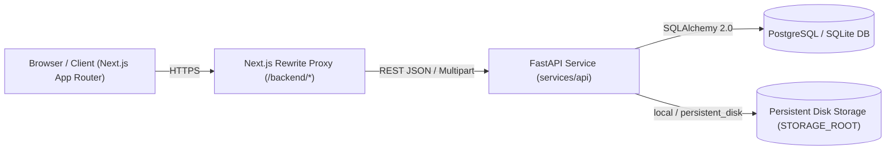

# PGCB Organization Portal — System Architecture

## 1. Architectural Overview

The PGCB Organization Portal is a monorepo comprising two primary deployable services:
1. **Frontend Web Application (`apps/web`)**: Next.js 15 App Router application written in TypeScript with Tailwind CSS, providing the public institutional portal, the authenticated member self-service portal, and the role-gated Secretariat Administration Console.
2. **Backend API Service (`services/api`)**: FastAPI Python 3.12 application backed by SQLAlchemy 2.0 ORM, Alembic migrations, Pydantic v2 validation, and ReportLab/QRCode document generation.

---

## 2. Backend Layered Architecture (`services/api`)

- **`app/main.py`**: Application entrypoint, explicit CORS configuration, `SecurityMiddleware`, global `StarletteHTTPException` structured error handler, and router registration.
- **`app/core/`**:
  - `config.py`: Strongly typed `Settings` loaded via `pydantic-settings`.
  - `security.py`: PBKDF2/bcrypt password hashing, JWT creation/verification, and HMAC-SHA256 verification token signing.
  - `rbac.py`: 7-role permission matrix (`SUPER_ADMIN`, `CONTENT_EDITOR`, `MEMBERSHIP_OFFICER`, `CIRCLE_ADMIN`, `FINANCE_OFFICER`, `AUDITOR`, `MEMBER`) and `require_permission` FastAPI dependency.
  - `middleware.py`: `SecurityMiddleware` injecting `X-Request-ID` (`request.state.request_id`), strict security headers (`X-Content-Type-Options`, `X-Frame-Options`, `Referrer-Policy`), CSRF double-submit verification for cookie-authenticated mutations, and rate limiting.
  - `mfa.py`: RFC 6238 TOTP secret generation, Fernet encryption at rest, and QR provisioning URI generation.
- **`app/models/`**: SQLAlchemy 2.0 declarative models (`User`, `Member`, `MemberDocument`, `Circle`, `CommitteeMember`, `Circular`, `Notice`, `OrganizationalDocument`, `Event`, `EventRegistration`, `Journal`, `MediaAsset`, `Certificate`, `PaymentTransaction`, `MembershipRenewal`, `ContentWorkflow`, `AuditLog`, `Notification`, `NotificationDelivery`, `SiteSetting`).
- **`app/services/`**: Domain service layer encapsulating transactional business logic:
  - `MembershipService`: Application submission, review transitions, ID assignment (`PGD-YYYY-XXXX`), and status tracking.
  - `EventService`: Event creation, capacity-aware registration, ticket code issuance (`PGCB-EVT-*`), and QR attendance check-in.
  - `CertificateService`: Cryptographic token generation, PDF certificate rendering with embedded QR codes, revocation, and privacy-safe public verification.
  - `PaymentService`: Financial transaction recording, reconciliation, and automatic membership renewal upon payment confirmation.
  - `EmailService`: Transactional email formatting and delivery logging.
- **`app/utils/storage.py`**: Provider-neutral file storage supporting `local` and `persistent_disk` backends with path-traversal protection and zero proprietary cloud SDK lock-in.

---

## 3. Frontend Architecture (`apps/web`)

- **`app/`**: Next.js App Router pages organized by domain:
  - Public routes (`/`, `/about`, `/committee`, `/membership/*`, `/events/*`, `/circulars/*`, `/notices/*`, `/documents`, `/journal/*`, `/gallery`, `/media`, `/contact`, `/search`, `/verify`, `/certificates/verify`, `/member/verify/[membership_id]`).
  - Member Portal (`/portal`, `/login`).
  - Multi-page Administration Panel (`/admin/*` with 21 specialized routes).
- **`components/admin/`**:
  - `AdminSidebar.tsx`: Permission-filtered navigation sidebar.
  - `AdminHeader.tsx`: Contextual page header with role/user metadata.
  - `StatusBadge.tsx`: Standardized semantic badge component across all workflows.
  - `PermissionGate.tsx`: Client-side RBAC guard complementing server-side enforcement.
- **`lib/api/`**: Modular TypeScript API client (`client.ts`, `types.ts`, `auth.ts`, `members.ts`, `applications.ts`, `events.ts`, `notices.ts`, `documents.ts`, `admin.ts`, `public.ts`).
